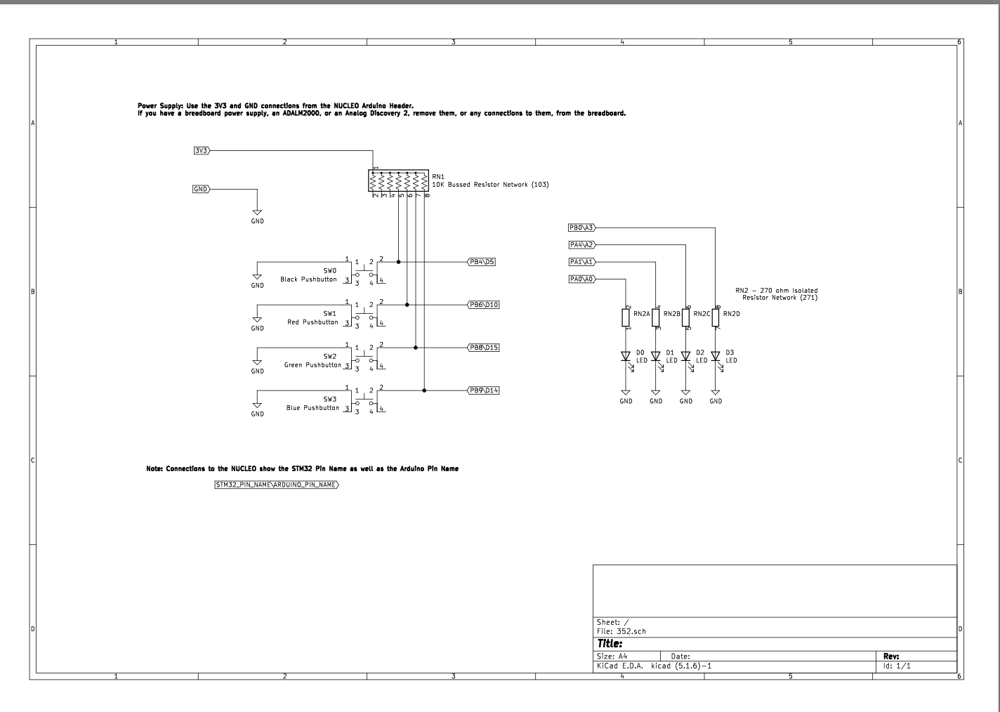

# Simon Says Game on STM32 Microcontroller

## Introduction

This project is an implementation of the classic "Simon Says" memory game using an **STM32F103RB** microcontroller. The game challenges players to memorize and reproduce increasingly long sequences of LED flashes by pressing corresponding buttons. It's a fun way to test memory skills while getting hands-on experience with microcontroller programming and hardware interfacing.

## [Video Demonstration]("https://youtu.be/QTLx9GiD8yk")

## How to Play

1. **Starting the Game:**
   - Press any of the four game buttons connected to the microcontroller to start the game.
   - The game will begin with a starting sequence where the LEDs flash in a specific pattern.

2. **Game Objective:**
   - The goal is to correctly repeat an ever-growing sequence of LED flashes.
   - Each round, the game adds a new flash to the sequence, increasing the difficulty.

3. **Gameplay:**
   - **Watch the Sequence:**
     - The game will flash a sequence of LEDs.
     - Pay close attention to the order and colors (if LEDs are colored).
   - **Brief Pause Before Input:**
     - After the sequence is displayed, there will be a short delay before you can input your response.
     - **Please wait for a few seconds** until the game is ready for your input.
     - This pause ensures the game transitions properly from displaying the sequence to accepting player input.
   - **Repeat the Sequence:**
     - Once the delay has passed, reproduce the sequence by pressing the corresponding buttons.
     - Each button corresponds to a specific LED.
   - **Time Limit:**
     - You must press the correct button within the allotted time, or the game will end.
   - **Feedback:**
     - Correct button presses will light up the corresponding LED as feedback.
     - Incorrect presses or timeouts will trigger the game over sequence.

4. **Winning the Game:**
   - Successfully repeat the sequences for all 10 rounds to win the game.
   - Upon winning, a victory LED sequence will be displayed.

5. **Game Over:**
   - If you press the wrong button or fail to press any button within the time limit, the game ends.
   - A game over LED sequence will be displayed.
   - You can restart the game by pressing any game button.

## Hardware Schematic

### Components Required

- **STM32F103RB Microcontroller Board** (e.g., STM32 Nucleo-F103RB)
- **4 LEDs**
- **4 Push Buttons** (momentary switches)
- **Resistors for LEDs** (e.g., 220Ω)
- **Resistors for Buttons** (e.g., 1KΩ)
- **Breadboard and Jumper Wires**

### Pin Connections

#### LEDs (Outputs)

| LED Number | Microcontroller Pin | GPIO Port | Pin Number | Board Pin Label |
|------------|---------------------|-----------|------------|-----------------|
| **LED 0**  | PA0                 | GPIOA     | 0          | **A0**          |
| **LED 1**  | PA1                 | GPIOA     | 1          | **A1**          |
| **LED 2**  | PA4                 | GPIOA     | 4          | **A2**          |
| **LED 3**  | PB0                 | GPIOB     | 0          | **D3**          |

- Connect one end of each LED to the corresponding microcontroller pin via a current-limiting resistor.
- Connect the other end of each LED to **GND**.

#### Buttons (Inputs)

| Button Number | Microcontroller Pin | GPIO Port | Pin Number | Board Pin Label |
|---------------|---------------------|-----------|------------|-----------------|
| **Button 0**  | PB4                 | GPIOB     | 4          | **D5**          |
| **Button 1**  | PB6                 | GPIOB     | 6          | **D10**         |
| **Button 2**  | PB8                 | GPIOB     | 8          | **D15**         |
| **Button 3**  | PB9                 | GPIOB     | 9          | **D14**         |

- Connect one terminal of each button to the corresponding microcontroller pin.
- Connect the other terminal of each button to **GND**.
- Enable internal pull-up resistors in the microcontroller or use external pull-up resistors connected to **VCC**.

### Schematic Diagram

## Code Overview

The program is written in **C** and utilizes the **STM32 Standard Peripheral Library**.

### Main Components

- **`main.c`**: Contains the `main()` function and core game logic.
- **`main.h`**: Header file with declarations and global variables.

### Functions and Their Descriptions

#### `main()`

- Initializes the system by calling `setup()`.
- Enters an infinite loop waiting for the game to start.
- On detecting a start condition, it runs the `startingseq()`, seeds the random number generator, and starts the game by calling `simon()`.
- After the game ends, it displays the end sequence by calling `gameendseq()`.

#### `setup()`

- Configures the microcontroller's GPIO pins for inputs and outputs.
- Enables the clocks for GPIOA, GPIOB, and GPIOC.
- Sets up the pin modes and configurations for LEDs and buttons.

#### `delay()`, `delay2()`, `delayShort()`

- Software delay functions used to create timing intervals.
- `delay()` is used for longer waits.
- `delay2()` is used for medium-length waits.
- `delayShort()` is used for debouncing and short delays.

#### `debounce()`

- Calls `delayShort()` to implement a simple debounce mechanism for button presses.

#### `startgame()`

- Checks if any of the game buttons are pressed to start the game.
- Returns `true` if a button press is detected, `false` otherwise.

#### `startingseq()`

- Displays an initial LED sequence while waiting for the game to start.
- Runs a forward and reverse LED sequence.
- Exits if a game button is pressed.

#### `simon()`

- Core game function that implements the Simon Says logic.
- Manages the game rounds and sequences.
- Displays the LED sequence to the player.
- Introduces a brief delay after the sequence to prepare for player input.
- Calls `delay3()` to get and validate the player's input.
- Increments the round and updates the sequence for the next round.
- Calls `gamewon()` if the player successfully completes all rounds.

#### `delay3(int expectedInput, int *currRoundScore)`

- Waits for the player to press the correct button within a specified timeout.
- Detects correct and incorrect button presses.
- Provides feedback by lighting up the corresponding LED.
- Returns `1` if the correct button is pressed, `0` if incorrect or timeout occurs.

#### `gamewon()`

- Displays a victory LED sequence when the player wins the game.
- Turns on all LEDs simultaneously in a flashing pattern.

#### `gameLost()`

- Displays a game over LED sequence when the player loses.
- Alternates LEDs to indicate the game has ended.

#### `gameendseq()`

- Continuously displays the current round until the player decides to start a new game.
- Waits for a button press to exit the sequence.

#### `displayRound()`

- Displays the current round number using LEDs.
- Lights up LEDs in a pattern corresponding to the round number.

#### `turnoffLED()`

- Ensures all LEDs are turned off.
- Used before starting new sequences or displaying the round.

## Getting Started

### Prerequisites

- **STM32 Development Environment** (e.g., STM32CubeIDE, Keil MDK, or other compatible IDE)
- **STM32 Standard Peripheral Library**
- Basic knowledge of **C programming** and **microcontroller development**

### Building and Flashing the Program

1. **Set Up the Development Environment:**
   - Install the necessary tools and libraries for STM32 development.

2. **Import the Project:**
   - Create a new project in your IDE and add `main.c` and `main.h`.

3. **Compile the Code:**
   - Build the project to compile the code and generate the binary.

4. **Flash the Microcontroller:**
   - Connect your STM32 board to your computer using a USB cable or programmer.
   - Flash the compiled binary to the microcontroller.

5. **Connect the Hardware:**
   - Assemble the circuit as per the schematic.
   - Ensure all connections are secure.

6. **Run the Game:**
   - Power on the microcontroller.
   - Press a game button to start playing.

## Customization

- **Adjusting Difficulty:**
  - Modify the delay values in `delay()`, `delay2()`, and `delay3()` to change the speed of the game and time allowed for player input.

- **Changing LED Patterns:**
  - Update the LED sequences in `startingseq()`, `gamewon()`, and `gameLost()` for different visual effects.

- **Expanding the Game:**
  - Increase the number of rounds or add more LEDs and buttons for greater difficulty.

## Troubleshooting

- **Buttons Not Responding:**
  - Check the wiring of the buttons and ensure pull-up resistors are enabled.
  - Verify that the buttons are connected to the correct GPIO pins.

- **LEDs Not Lighting Up:**
  - Ensure LEDs are connected with the correct polarity.
  - Check the current-limiting resistors and connections to the GPIO pins.

- **Game Not Starting:**
  - Verify that the microcontroller is properly programmed.
  - Check the power supply and all connections.

- **Input Not Accepted Immediately After Sequence:**
  - Remember that there is a brief pause after the LED sequence before you can input your response.
  - Wait for a few seconds after the sequence finishes before pressing the buttons.

## Acknowledgments

- **Schematic Source:**
  - The schematic used in this project is provided by **Trevor Douglous**, U of R ENSE Lab instructor.

- **STM32 Documentation:**
  - Refer to the **STM32F103RB** reference manual and datasheets for detailed information on registers and peripherals.

## License

This project is open-source and free to use for educational purposes.

---

If you have any questions or need further assistance, feel free to reach out!